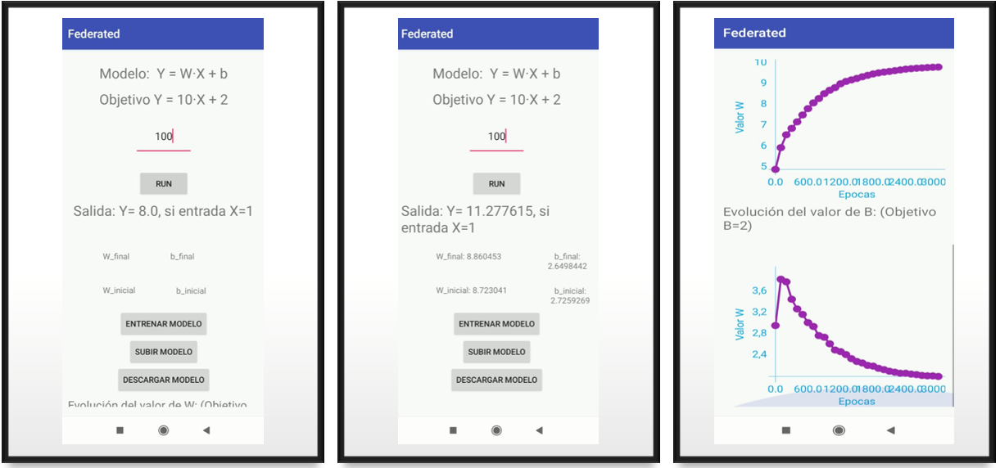

# FederatedLearnig_Demo
This is the code I created for showing the possibility of creating a simple linear regression model with tensorflow and used it in an android app in order to use Federated Learning. Here is both the **app** and **server** code. Also the machine learning **model** file. 

In this project I created a machine learning model and train it on device with my phone. 





### How it works:

  Your device downloads the current model, improves it by learning from data on your phone, and then summarizes the changes as a small focused update. Only this update to the model is sent to the cloud( I used Heroku  and Google Cloud but other could be used), where it is immediately averaged with other user updates to improve the shared model. All the training data remains on your device, and no individual updates are stored in the cloud.
  
  


### Model:
``` python

import tensorflow.compat.v1 as tf
tf.disable_v2_behavior()
from __future__ import print_function
from tensorflow.keras.callbacks import TensorBoard

x = tf.placeholder(tf.float32, name='input')
y_ = tf.placeholder(tf.float32, name='target')
W = tf.Variable(5., name='W')
b = tf.Variable(3., name='b')

y = tf.add(tf.multiply(x, W), b)
y = tf.identity(y, name='output')

loss = tf.reduce_mean(tf.square(y - y_),name ="loss")
optimizer = tf.train.GradientDescentOptimizer(learning_rate=0.01)
train_op = optimizer.minimize(loss, name='train')

init = tf.global_variables_initializer()

 # Creating a tf.train.Saver adds operations to the graph to save and
 # restore variables from checkpoints.

saver_def = tf.train.Saver().as_saver_def()
with open('graph_mul.pb', 'wb') as f:
  f.write(tf.get_default_graph().as_graph_def().SerializeToString())

print('Operation to initialize variables:       ', init.name)
print('Tensor to feed as input data:            ', x.name)
print('Tensor to feed as training targets:      ', y_.name)
print('Tensor to fetch as prediction:           ', y.name)
print('Operation to train one step:             ', train_op.name)
print('Tensor to be fed for checkpoint filename:', saver_def.filename_tensor_name)
print('Operation to save a checkpoint:          ', saver_def.save_tensor_name)
print('Operation to restore a checkpoint:       ', saver_def.restore_op_name)
print('Tensor to read value of W                ', W.value().name)
print('Tensor to read value of b                ', b.value().name) 
print('Trainable variables: ', tf.trainable_variables())
print('Loss:       ', loss.name)
print('Loss:       ', loss.value)

saver = tf.train.Saver()
sess = tf.Session()
sess.run(init)
saver.save(sess, "/content/sample_data/h"+"/checkpoint_name.ckpt")

# For watching the graph
from __future__ import print_function
writer = tf.summary.FileWriter('.')
writer.add_graph(tf.get_default_graph())
writer.flush()


/content/sample_data/h/checkpoint_name.ckpt.data-00000-of-00001
```

### References: 

 (1)[Google AI Blog](https://ai.googleblog.com/2017/04/federated-learning-collaborative.html)

 (2)[Vision Air](https://vision-air.github.io/index.html)

